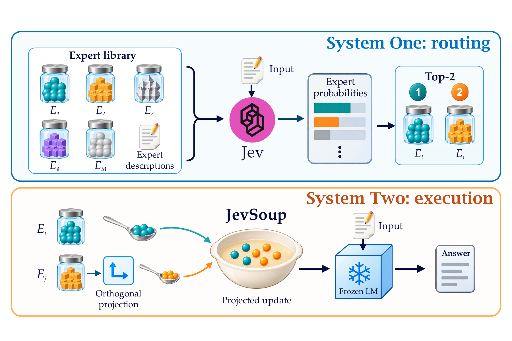

<div align="center">

# JevSoup
### System-One Routing for Training-Free LoRA Composition

Jiahua Cheng · Xiuying Wang · Yichen Li

[](#citation)
[](docs/GETTING_STARTED.md)
[](https://huggingface.co/datasets/RampPublic/portallib-tasks)

</div>

<p align="center">
  
</p>

**JevSoup** combines lightweight expert selection with orthogonal LoRA
composition. Given an input and textual expert descriptions, System One
selects an ordered pair of experts. System Two preserves the first expert's
update, projects the second away from its row space, and combines the two
with equal weights on a frozen language model. No router training or expert
training samples are required by JevSoup.

## 🚀 Getting Started

See the [installation and quick-start guide](docs/GETTING_STARTED.md) to
download resources and run your first experiment.

| Guide | Contents |
| --- | --- |
| [Getting started](docs/GETTING_STARTED.md) | Installation, downloads, Jev routing, inference and evaluation |
| [Baselines](docs/BASELINES.md) | Base, Adaptive Minds, LoGo, AdapterSoup and Arrow |
| [Experiments](docs/EXPERIMENTS.md) | Full evaluation, ablations, sensitivity and GPU profiling |
| [Evaluation protocol](docs/PROTOCOL.md) | Data splits, scoring and implementation details |

The repository includes only the paper's main comparison, 4B ablation and
projection-strength sensitivity experiments, plus the tools needed to run and
verify them. It contains source code and documentation only. Model weights and
benchmark data are downloaded separately. Predictions, routing caches and
execution logs are generated locally and are not distributed in this repository.

## 🧩 What Is in This Repository?

### System One: Expert Routing

Jev ranks a library of 14 expert descriptions for each input. Routing decisions
are cached locally and can be reused across Qwen3-1.7B, Qwen3-4B and Qwen3-8B.
New Jev requests require a TypeSafe API key; local baselines do not.

### System Two: Orthogonal Composition

The selected LoRA experts are combined at each query/value projection. The
orthogonal residual is computed from the complete expert update, with the
original LoRA scaling retained. The implementation also includes unprojected
and probability-weighted controls.

### Common-Protocol Evaluation

All methods use the same candidate-continuation scoring and evaluation split.
The baseline adaptations, Top-2 settings and training-sample requirements are
described in the [protocol](docs/PROTOCOL.md).

## 📊 Main Results

Each cell reports **macro / micro accuracy (%)** on the full PorTAL evaluation
split used in the paper. Macro averages tasks equally; micro averages examples.

| Method | Qwen3-1.7B | Qwen3-4B | Qwen3-8B |
| --- | ---: | ---: | ---: |
| Base | 58.05 / 61.79 | 64.05 / 69.76 | 68.15 / 74.41 |
| Adaptive Minds | 69.79 / 67.15 | 74.11 / 72.49 | 77.07 / 78.54 |
| LoGo | 68.74 / 64.96 | 71.43 / 69.75 | 75.94 / 77.01 |
| AdapterSoup | 69.18 / 66.85 | 73.61 / 72.60 | 76.86 / 77.87 |
| Arrow | 69.12 / 65.81 | 72.65 / 71.27 | 76.45 / 77.11 |
| **JevSoup** | **70.91 / 67.40** | **75.30 / 73.81** | **77.29 / 78.73** |

## 📂 Code Structure

```text
JevSoup/
├── assets/          # Framework illustration
├── jevsoup/         # Public experiment entry points
├── jev_lora/        # Data preparation, routing, model loading and scoring
├── scripts/         # Composition engines, baselines, downloads and profiling
├── tests/           # Offline regression tests
├── docs/            # Usage and experiment guides
└── README.md
```

## Citation

Paper and arXiv links will be added when available. Author metadata is provided
in [CITATION.cff](CITATION.cff); the provisional manuscript citation is:

```bibtex
@unpublished{cheng2026jevsoup,
  title  = {JevSoup: System-One Routing for Training-Free LoRA Composition},
  author = {Cheng, Jiahua and Wang, Xiuying and Li, Yichen},
  year   = {2026},
  note   = {Manuscript}
}
```

## Acknowledgements

We build on PorTAL, Qwen3, PEFT and the baseline methods credited in
[THIRD_PARTY.md](THIRD_PARTY.md). Their models, datasets and services retain
their respective licenses and terms.

## License

The project license will be added before public distribution. Third-party
notices are retained separately; see [THIRD_PARTY.md](THIRD_PARTY.md).
